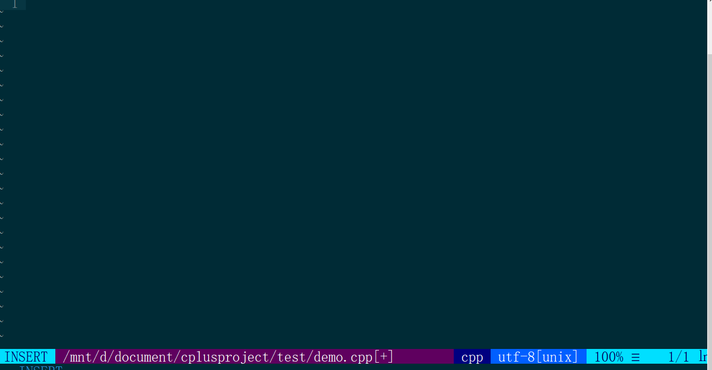

# 在windows上使用Ubuntu并配置多种语言开发境

## 0 效果
### 使用C++


## 1 开启WSL服务并安装Ubuntu

自己利用搜索引擎去查找相关资料并安装，很容易的就两步

## 2 安装各类编程语言的相关依赖

### Node安装

**为什么不直接使用apt install安装Nodejs呢？**

因为版本太旧，想直接使用node12

**手动安装已编译版本**

```bash
cd ~
wget https://nodejs.org/dist/v12.13.1/node-v12.13.1-linux-x64.tar.xz
tar -zxvf ./node-v12.13.1-linux-x64.tar.xz -C ~/
mv node-v12.13.1-linux-x64/ node12
```

**注意：这里需要配置环境变量**

```bash
sudo vi /etc/profile
# 将文件尾部添加这两行
export NODE_HOME=$HOME/node12
export PATH=$NODE_HOME:$NODE_HOME/bin:$PATH 

source /etc/profile
```


### Python安装

```bash
sudo apt install python3
sudo ln -s /usr/bin/python3 /usr/bin/python
```


### Go安装

```
cd ~ 
wget https://studygolang.com/dl/golang/go1.13.5.linux-amd64.tar.gz
tar -zxvf ./go1.13.5.linux-amd64.tar.gz -C ~/
```

**注意：这里需要配置环境变量**

```bash
sudo vi /etc/profile
# 将文件尾部添加这三行
export GOROOT=$HOME/go
export GOPATH=$HOME/src/go # 自根据自己的需要更改
export PATH=$GOROOT:$GOROOT/bin:$GOPATH:$PATH 
# 刷新配置
source /etc/profile
```


### Java安装

这里安装java8，如果想安装其它版本，可以在窗口直接输入java，那么ubuntu会提示你可以安装哪些版本，按需求装就可以了

`sudo apt install openjdk-8-jre-headless`


### Rust安装

安装的是stable版本，不是nightly版本，目录在$HOME目录中

`curl --proto '=https' --tlsv1.2 -sSf https://sh.rustup.rs | sh`

过程中直接选1，默认安装

**注意：这里需要配置环境变量**

```bash
sudo vi /etc/profile
# 将文件尾部添加以下内容
export PATH=$HOME/.cargo:$PATH 
# 刷新配置
source /etc/profile
```


## 3 安装neovim及插件管理vim-plug

#### 安装neovim

```
cd ~
wget https://github.com/neovim/neovim/releases/download/v0.4.3/nvim-linux64.tar.gz
tar -zxvf ./nvim-linux64.tar.gz -C ~/
mv nvim-linux64/ nvim
```

**注意：这里需要配置环境变量**

```bash
sudo vi /etc/profile
# 将文件尾部添加以下内容
export NVIM_HOME=$HOME/nvim
export PATH=$NVIM_HOME:$NVIM_HOME/bin:$PATH
# 刷新配置
source /etc/profile
```


#### 安装vim-plug

```bash
curl -fLo ~/.local/share/nvim/site/autoload/plug.vim --create-dirs     https://raw.githubusercontent.com/junegunn/vim-plug/master/plug.vim
```

**注意：**上面安装成功，但是启动neovim时，使用插件安装命令PlugInstall，有可能提示未知命令，那么直接执行以下操作

```bash
cd ~/.local/share/nvim/site/autoload/
wget https://github.com/junegunn/vim-plug/archive/0.10.0.tar.gz
rm ./plug.vim # 如果存在的话，请执行此命令，不存在不用执行
tar zxvf 0.10.0.tar.gz 
cp vim-plug-0.10.0/plug.vim ./
# 在autoload目录下，其它文件删不删由你自己决定，只要保留plug.vim就可以了
```

## 4 安装Coc及配置

### 安装Coc

```bash
sudo mkdir ~/.config/nvim
cd ~/.config/nvim
vi init.vim
```

### 输入以下内容，注意Linux与Windows的换行符问题，如果出现Error，请单行复制

```bash
call plug#begin('~/.vim/plugged')
" Coc
Plug 'neoclide/coc.nvim', {'branch': 'release'}

" 主题
Plug 'lifepillar/vim-solarized8'

" 状态栏美化
Plug 'vim-airline/vim-airline'

call plug#end()
```

### 安装插件

上面执行后保存退出，执行nvim命令

```bash
nvim
# 进入命令行模式，执行以下命令，会自动安装上面的相关插件
PlugInstall
```

### 配置

安装后，执行`nvim ~/.config/nvim/init.vim`，添加以下配置

```bash
" 主题配置
syntax enable
set termguicolors " 一定要设置，不然颜色有可能不对
set background=dark
colorscheme solarized8

" Tab 转4个空格
set tabstop=4
set shiftwidth=4        " Indents will have a width of 4
set softtabstop=4       " Sets the number of columns for a TAB
set expandtab           " Expand TABs to spaces

" 剩下的配置在：https://github.com/neoclide/coc.nvim#example-vim-configuration
" 复制到此处
```


## 5 配置服务器

### 安装相应的语言服务器

#### Typescript

`npm install typescript`


#### Python

```bash
sudo apt install python3-pip
pip3 install jedi
```


#### C|C++

```bash
sudo apt-get install clang-tools-8
sudo cp /usr/bin/clangd-8 /usr/bin/clangd
nvim
# 进入命令行模式，执行CocConfig命令
CocConfig
# 自动进入配置文件，输入以下内容，则C系列配置完毕

{
"languageserver": {
    "clangd": {
      "command": "clangd",
      "args": ["--background-index"],
      "rootPatterns": ["compile_flags.txt", "compile_commands.json", ".vim/", ".git/", ".hg/"],
      "filetypes": ["c", "cpp", "objc", "objcpp"]
    }
  }
}
```


## 6 安装Coc扩展

扩展介绍：https://github.com/neoclide/coc.nvim/wiki/Using-coc-extensions

以下命令安装了许多的扩展，如果不需要全部，可以自行删除或者添加相应的扩展

```bash
# 执行nvim，进入neovim
# 切换成命令行模式，执行以下命令
CocInstall coc-json coc-tsserver coc-html coc-css coc-vetur coc-rls coc-python coc-highlight coc-snippets coc-lists coc-vimlsp coc-flow coc-pairs coc-emmet

```